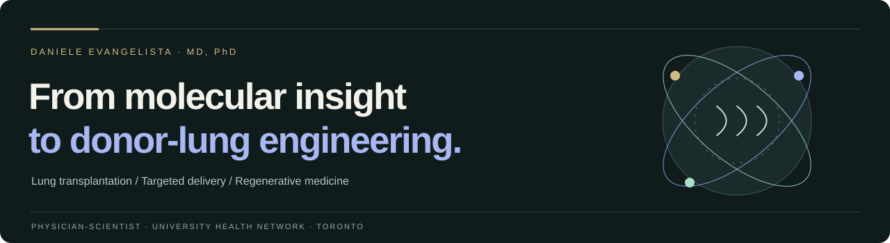

<table>
  <tr>
    <td width="74%" valign="middle">
      
LUNG TRANSPLANTATION · REGENERATIVE MEDICINE

      <h1>Daniele Evangelista, MD, PhD</h1>
      
<strong>Physician-scientist · Postdoctoral Research Fellow</strong> Latner Thoracic Research Laboratories University Health Network · Toronto, Canada

      
Connecting molecular research with the clinical challenge of improving donor-lung quality.

    </td>
    <td width="26%" align="center" valign="middle">
      
    </td>
  </tr>
</table>

  <a href="https://danieleevangelistaa.github.io/"><strong>Website</strong></a> &nbsp; · &nbsp;
  <a href="https://danieleevangelistaa.github.io/#research"><strong>Research</strong></a> &nbsp; · &nbsp;
  <a href="https://danieleevangelistaa.github.io/#publications"><strong>Publications</strong></a> &nbsp; · &nbsp;
  <a href="https://danieleevangelistaa.github.io/#contact"><strong>Connect</strong></a>

### Research direction

My work brings together **targeted therapeutic delivery**, **ex vivo lung perfusion (EVLP)** and **organ bioengineering**. I study lipid nanoparticle approaches to donor-lung engineering and the regenerative potential of extracellular matrix-derived hydrogels.

As a **2026 ISHLT Research Fellowship recipient**, I am investigating click chemistry for targeted mRNA delivery during EVLP. [Explore the fellowship](https://www.ishlt.org/grants-and-awards/grants-awards/ishlt-research-fellowship-grant).

| Focus | Research question |
| :--- | :--- |
| **Targeted delivery** | How can lipid nanoparticles deliver therapeutic cargo to donor lungs? |
| **EVLP** | How can the interval before transplantation support targeted treatment? |
| **Matrix & regeneration** | How can extracellular matrix cues support tissue repair and organ engineering? |

### Selected publications

- **[The molecular mechanisms of extracellular matrix-derived hydrogel therapy in idiopathic pulmonary fibrosis models](https://doi.org/10.1016/j.biomaterials.2023.122338)** · *Biomaterials*, 2023.
- **[Creation of Laryngeal Grafts from Primary Human Cells and Decellularized Laryngeal Scaffolds](https://pubmed.ncbi.nlm.nih.gov/31663421/)** · *Tissue Engineering Part A*, 2020.
- **[Regenerative potential of human airway stem cells in lung epithelial engineering](https://pubmed.ncbi.nlm.nih.gov/27622532/)** · *Biomaterials*, 2016.

[Browse the complete scholarly record →](https://danieleevangelistaa.github.io/#publications)

---

  <a href="https://orcid.org/0000-0002-2755-0091">ORCID</a> &nbsp; / &nbsp;
  <a href="https://pubmed.ncbi.nlm.nih.gov/?term=%22Daniele+Evangelista-Leite%22%5BAuthor%5D">PubMed</a> &nbsp; / &nbsp;
  <a href="https://ca.linkedin.com/in/daniele-evangelista-leite-da-silva-8680ab81">LinkedIn</a> &nbsp; / &nbsp;
  <a href="https://danieleevangelistaa.github.io/#contact">Research collaboration & scientific exchange</a>

Daniele Evangelista Leite da Silva · MD, PhD
